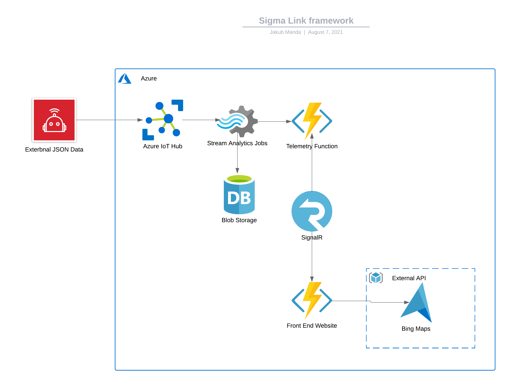

# Sigma Link: Vehicle Telemtry Monitoring Platform

## About Me

My name is Jakub Manda, I am a second year Computer and Electronic Systems student at University of Strathclyde. 

## The Premise

The idea behind this project is based on my role on University of Strathclyde’s Eco-Vehicle team where I am one of the people in charge of recording the telemetry data of our electric vehicle. The thing that I noticed and kept thinking about from the beginning was that when we are out on a track driving, or in a lab running tests on the vehicle, we aren’t able to see the data of how the vehicle reacts right away, and instead we have to download all of the data and analyse it afterwards.

I have decided to solve this problem by designing solution that will allow us to ingest vehicle’s data in real time, analyse in the cloud and visualise the data on a website for the end user to see how the vehicle is preforming. This includes data such as battery level, speed, acceleration, and GPS data that will be presented on map overlay.

## Project Structure

The project works by firstly having data sent to the IoT Hub. As soon as there is new data in the Hub, Stream Analytics sends the data over to backend HTTP Triggered function and to a Blob Storage to store the data. The backend HTTP Triger user SignalR to establis link between the backend and the frontend website. The website then accesses

## Tools and Services

### IoT Hub

IoT Hub was used to recieve data from the vehicles. Each one has to be set up beforehand in the IoT Hub and they each are assigned their own coonection string that is then used to establish connection between the Hub and the device.

### Stream Analytics

Now that we have the data coming into the IoT Hub, we need some way of getting it from there to a HTTP triggered function and a blob storage. Stream Analytics is a service designed exactly for that. Once your inputs and outputs are set up, everyting is done through SQL statements.

### Azure Functions (HTTP Triggers)

In one of the first iterations of this project, I was trying to control everything using HTTP Triggers and Time Triggered functions. That was before I found out about IoT Hub.

Now HTTP Functions are used only for the frontend website and a backend funtion that we are sending data to from IoT Hub. Together with SignalR the backend Function makes sure that the frontend website can access the data that we want to display.

### SignalR

SignalR is a free open-source software that allows server code to send asynchronous to client-side web application. In this project we are using it to create a connection between our backend HTTP Trigger and our frontend website. This way the website can access the data being sent to our backend right away and display it to the client without having to refresh.

### Blob Storage

All the data recieved by the IoT Hub is being stored in the storage by Stream Analytics. This is so that the data can be accessed at a lated date.

### Bing Maps

I decided to go with Bing Maps fro the map overlay as it was the easiest to set-up and get started with. I have concidered Azure Maps and Google Maps at the beggining but they weren't as straight forward and by this point I was shotr on time and needed to go with an option that would work righ away. Bing Maps also had a good documentation and has a whole interactive page for the developer to get a hands on feel for how some of the funcionalities work.

## Challenges + lessons learned

Large challange when building this project was trying to chose the correct tools for the job as I have never worked with Azure Services beffore and there are so many choose from. This is linked with the next challenge which was trying to come uo with an appropriate structure for the project.

Another challenge was tryinn to read data from the IoT Hub and figuring out how effective Stream Analytics is in that aspect.

## Thanks and Acknowledgements

I would firstly like to thanks the Bit Project for giving me the opportunity to take part in this session of Serverless camp and learn about Cloud based services in association with Microsoft.

I would also like to thank my mentor Ganesh Raskar for his great input in the planing and structuring this project.
