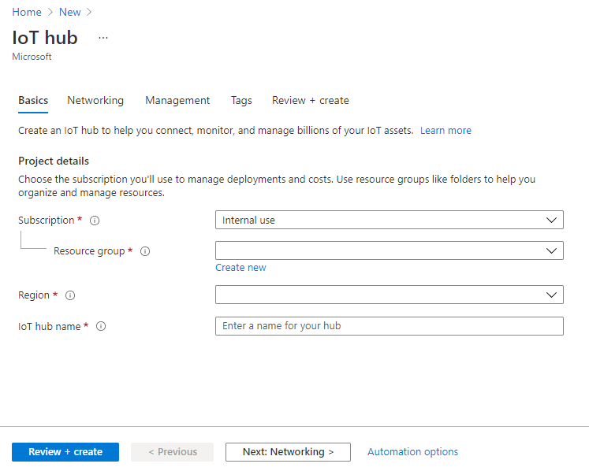
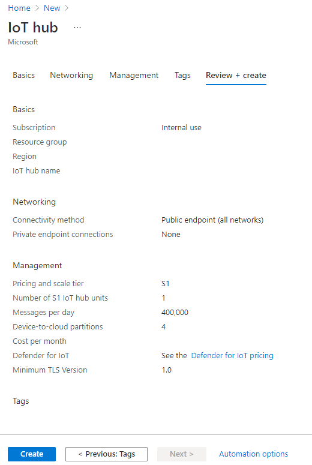
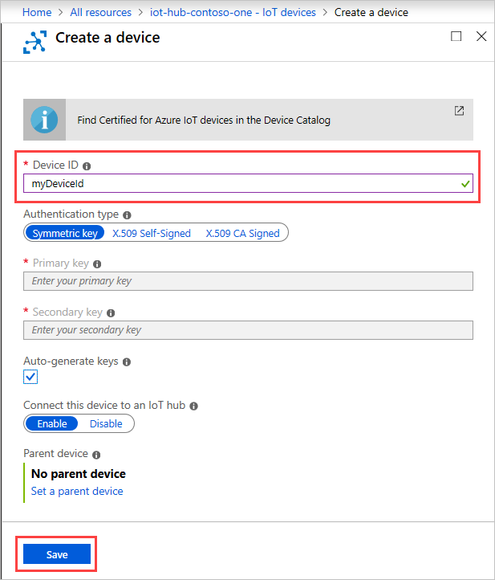
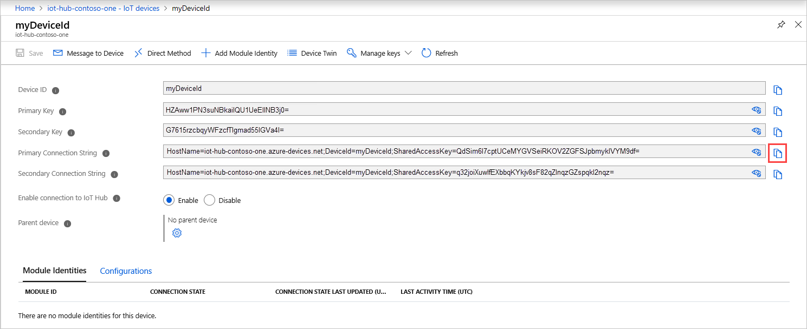

# Sigma Link: Vehicle Telemtry Monitoring Platform

## About Me

My name is Jakub Manda, I am a second year Computer and Electronic Systems student at University of Strathclyde. 

## The Premise

The idea behind this project is based on my role on University of Strathclyde’s Eco-Vehicle team where I am one of the people in charge of recording the telemetry data of our electric vehicle. The thing that I noticed and kept thinking about from the beginning was that when we are out on a track driving, or in a lab running tests on the vehicle, we aren’t able to see the data of how the vehicle reacts right away, and instead we have to download all of the data and analyse it afterwards.

I have decided to solve this problem by designing solution that will allow us to ingest vehicle’s data in real time, analyse in the cloud and visualise the data on a website for the end user to see how the vehicle is preforming. This includes data such as battery level, speed, acceleration, and GPS data that will be presented on map overlay.


## Tools used

Azure IoT Hub  
Azure Stream Analytics  
Azure Functions  
Azure SignalR Service  
Azure Blob Storage  
Bing Maps Dev Center  


## Step by step (with code snippets)
### Set Up
Create Azure account  
Download VS Code https://code.visualstudio.com/download  
Dwnload Node.js  

### Create an IoT Hub
1. Sign in to the Azure portal.

2. From the Azure homepage, select the + Create a resource button, and then enter IoT Hub in the Search the Marketplace field.

3. Select IoT Hub from the search results, and then select Create.

4. On the Basics tab, complete the fields as follows:

    - **Subscription:** Select the subscription to use for your hub.

    - **Resource Group:** Select a resource group or create a new one. To create a new one, select Create new and fill in the name you want to use. To use an existing resource group, select that resource group.

    - **Region:** Select the region in which you want your hub to be located. Select the location closest to you. Some features, such as IoT Hub device streams, are only available in specific regions. For these limited features, you must select one of the supported regions.

    - **IoT Hub Name:** Enter a name for your hub. This name must be globally unique, with a length between 3 and 50 alphanumeric characters. The name can also include the dash ('-') character.



5. Select **Next: Review + create** to review your choices. You see something similar to this screen, but with the values you selected when creating the hub.



### Register a new device in the IoT hub

In this section, you create a device identity in the identity registry in your IoT hub. A device cannot connect to a hub unless it has an entry in the identity registry.

1. In your IoT hub navigation menu, open IoT Devices, then select New to add a device in your IoT hub.
    


2. In Create a device, provide a name for your new device, such as myDeviceId, and select Save. This action creates a device identity for your IoT hub. Leave Auto-generate keys checked so that the primary and secondary keys will be generated automatically.



3. After the device is created, open the device from the list in the IoT devices pane. Copy the Primary Connection String. This connection string is used by device code to communicate with the hub.

By default, the keys and connection strings are masked as they are sensitive information. If you click the eye icon, they are revealed as shown in the image below. It is not necessary to reveal them to copy them with the copy button




Source:
https://docs.microsoft.com/en-us/azure/iot-hub/iot-hub-create-through-portal

### Create Stream Analytics Job

1. From the Azure homepage, select the + Create a resource button, and then enter Stream Analytics Job in the Search the Marketplace field.

2. Select IoT Hub from the search results, and then select Create.

3. Complete the fields as follows:
    
    - **Job Name:** Enter a name for your job.

    - **Subscription:** Select the subscription to use for your job.

    - **Resource Group:** Select a resource group or create a new one. To create a new one, select Create new and fill in the name you want to use. To use an existing resource group, select that resource group.

    - **Region:** Select the region in which you want your job to be located. Select the location closest to you.

    - **Streaming units:** Set the number of Streaming units to 1.

4. **Create** your Stream Analytics Job.

### Create SignalR

1. From the Azure homepage, select the + Create a resource button, and then enter SignalR in the Search the Marketplace field.

2. Select SignalR from the search results, and then select Create.

3. Complete the fields as follows:
    
    - **Subscription:** Select the subscription to use for your SignalR.

    - **Resource Group:** Select a resource group or create a new one. To create a new one, select Create new and fill in the name you want to use. To use an existing    resource group, select that resource group.

    - **Resource Name:** Enter a name for your resource.

    - **Region:** Select the region in which you want your hub to be located. Select the location closest to you.

    - **Pricing:** Select Free.

    - **Service Mode:** Serverless.

4. Select **Next: Review + create** to review your choices.

### Create a Blob storage

1. From the Azure homepage, select the + Create a resource button, and then enter Storage account in the Search the Marketplace field.

2. Select Storage account from the search results, and then select Create.

3. Complete the fields as follows:

    - **Subscription:** Select the subscription to use for your storage.

    - **Resource Group:** Select a resource group or create a new one. To create a new one, select Create new and fill in the name you want to use. To use an existing resource group, select that resource group.

    - **Storage account Name:** Enter a name for your resource.

    - **Region:** Select the region in which you want your hub to be located. Select the location closest to you.

    - **Performance** Select Standard.

4. Select **Next: Review + create** to review your choices.

### Get Bing Map Key

1. Create Bing Maps account https://www.bingmapsportal.com/

2. Create an API Key

### Negotiate Function

For the SignalR link to work we need a negotiate function.

1. Create a HTTP Trigger called **negotiate**

2. Replace the content of index.js with the following:

```
module.exports = async function (context, req, connectionInfo) {
    context.res.body = connectionInfo;
};
```

3. Replace the content of index.json with the following:

```
{
  "bindings": [
    {
      "authLevel": "function",
      "type": "httpTrigger",
      "direction": "in",
      "name": "req",
      "methods": [
        "get",
        "post"
      ]
    },
    {
      "type": "http",
      "direction": "out",
      "name": "res"
    },
    {
      "type": "signalR",
      "name": "signalRMessages",
      "hubName": "serverless",
      "connectionStringSetting": "AzureSignalRConnectionString",
      "direction": "out"
    }
  ]
}
```

4. **Deploy** your function on Azure and add the 'AzureSignalRConnectionString' as a secret.

### Writing Function

This function will recieve data from Stream Analytics Job and 

1. Create a HTTP Trigger Function

2. The code that recieves the data and passes them into SingnalR shoould look something like this:

```
var data = req.body[0];
context.log(req.body[0]);

context.bindings.signalRMessages = [{
    "target": "newMessage",
    "arguments": [data]
}]
context.done();
```

3. In the function.json folder the following binding has to be added:

```
{
  "type": "signalR",
  "name": "signalRMessages",
  "hubName": "serverless",
  "connectionStringSetting": "AzureSignalRConnectionString",
  "direction": "out"
}
```

4. **Deploy** your function.

### Front End
    
> Instead of depoloying the front end as a Static Web App as intended at the begining, the front end will beusing a HTTP Trigger

1. Create a HTTP Trigger

2. In the same folder create HTML file

3. Place the following code in the index.js folder that loads the html file:

```
var fs = require('fs').promises

module.exports = async function (context, req) {
    //const path = context.executionContext.functionDirectory + '/../index.html'
    try {
        var data = await fs.readFile('index/index.html');
        context.res = {
            headers: {
                'Content-Type': 'text/html'
            },
            body: data
        }
        context.done()
    } catch (error) {
        context.log.error(error);
        context.done(error);
    }
}
```

4. In the html file place in a script that will access the SignalR data:

```
<script src="https://cdnjs.cloudflare.com/ajax/libs/microsoft-signalr/3.1.7/signalr.min.js"></script>
<script>
    let messages = document.querySelector('#messages');
    const apiBaseUrl = window.location.origin;
    const connection = new signalR.HubConnectionBuilder()
      .withUrl(apiBaseUrl + '/api')
      .configureLogging(signalR.LogLevel.Information)
      .build();
    connection.on('newMessage', (message) => {
      // code to diplay data goes here
    });

    connection.start()
      .catch(console.error);
  </script>
```

5. In the html file place in a script that will create a map:

```
<script type='text/javascript'>
    var map;
    var pushpin;
    function loadMapScenario() {
      map = new Microsoft.Maps.Map(document.getElementById('myMap'), {
        center: new Microsoft.Maps.Location(55.861340, -4.243425),
        zoom: 18,
        showMapTypeSelector: false
      });
      pushpin = new Microsoft.Maps.Pushpin(map.getCenter(), { color: 'rgb(0, 165, 255)' });
      map.entities.push(pushpin);
    }
    function update(long, lat) {
      map.setView({ center: new Microsoft.Maps.Location(long, lat) });
      pushpin.setLocation(new Microsoft.Maps.Location(long, lat));
    }
</script>
  <script type='text/javascript'
    src='https://www.bing.com/api/maps/mapcontrol?key=YourAPIKey&callback=loadMapScenario'
    async defer></script>
```

### Connecting Stream Analytics to IoT Hub and Azure Function

#### Configure job input

1. Navigate to your Stream Analytics job.

2. Select Inputs > Add Stream input > IoT Hub.

3. Fill out the IoT Hub page with the following values:

    - **Input alias:** Enter a name to identify the job’s input.

    - **Subscription:** Select the Azure subscription that has the storage account you created. The storage account can be in the same or in a different subscription.This example assumes that you have created storage account in the same subscription.

    - **IoT Hub:** Enter the name of the IoT Hub you created in the previous section.

4. Save your input

#### Configure job outputs

##### Blob storage

1. Navigate to your Stream Analytics job.

2. Select Outputs > Add > Blob storage.

3. Fill out the Blob storage page with the following values:

    - **Output alias:** Enter a name to identify the job’s output.

    - **Subscription:** Select the Azure subscription that has the storage account you created. The storage account can be in the same or in a different subscription. This example assumes that you have created storage account in the same subscription.

    - **Storage account:** Choose or enter the name of the storage account. Storage account names are automatically detected if they are created in the same subscription.

    - **Container:** Select the existing container that you created in your storage account.

4. Save your output

##### Azure Function

1. Navigate to your Stream Analytics job.

2. Select Outputs > Add > Azure Function.

3. Fill out the Azure Function page with the following values:

    - **Output alias:** Enter a name to identify the job’s output.

    - **Subscription:** Select the Azure subscription that has the storage account you created. The storage account can be in the same or in a different subscription. This example assumes that you have created storage account in the same subscription.

    - **Function App:** Choose or enter the name of the function app.

    - **Function:** Select the function you want as your output
    
    - **Key name:** Default.

4. Save your output

#### Query

1. Navigate to your Stream Analytics job.

2. Select Query and change the SQL statement to include your input and outputs:

```
SELECT
    *
INTO
    BlobStorageOut
    FunctionOut
FROM
    IoTHubIn
```


**Start** your Analytics Job.

## Challenges + lessons learned

Large challange when building this project was trying to chose the correct tools for the job as I have never worked with Azure Services beffore and there are so many choose from. This is linked with the next challenge which was trying to come uo with an appropriate structure for the project.

Another challenge was tryinn to read data from the IoT Hub and figuring out how effective Stream Analytics is in that aspect.

## Thanks and Acknowledgements

I would firstly like to thanks the Bit Project for giving me the opportunity to take part in this session of Serverless camp and learn about Cloud based services in association with Microsoft.

I would also like to thank my mentor Ganesh Raskar for his great input in the planing and structuring this project.
